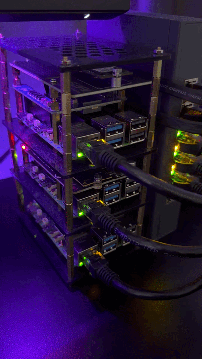

# hlab

GitOps repo for my home lab.

It runs on a 3-node Raspberry Pi 5 k3s cluster and is used for self-hosting, testing, and learning Kubernetes/cloud-native tooling.

  

## What is here

- `bootstrap/argocd`: Argo CD bootstrap manifests
- `charts/infrastructure`: cluster infrastructure like MetalLB, cert-manager, ingress-nginx, and sealed-secrets
- `charts/platform`: platform services like Argo CD, monitoring, and Keycloak
- `charts/apps`: apps like AdGuard Home, Homepage, and  media server stack
- `charts/data`: data services like PostgreSQL

## Deployment model

Argo CD manages this repo and syncs the cluster from the Helm charts in `charts/`.

Bootstrap starts from:

- `bootstrap/argocd/root-application.yaml`

That root app applies the AppProject and ApplicationSet, which then deploy the rest of the stack.
